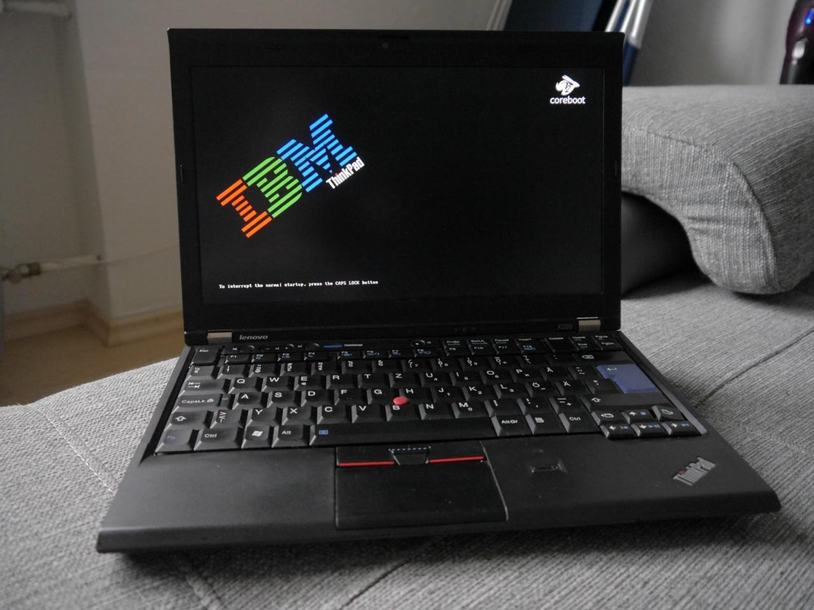
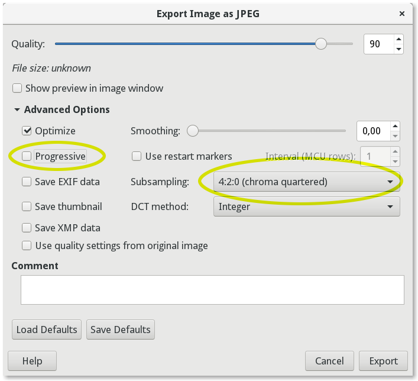

## How to add your custom bootsplash to SeaBIOS  
  
  
  
**WARNING!** Proceed at your own risk! Be sure to have a Raspberry Pi and a Pomona clip handy in case you mess up.  
  
**1. Saving the image**  
Open the desired image and export it as JPG, in the saving options change "Subsampling" to 4:2:0 and uncheck "Progressive":  
  
<sub><sup>screenshot taken from: https://puri.sm/posts/librem-13-coreboot-report-february-25th-2017/</sub></sup>
  
The output image must be 1024px wide and 768px tall. Don't forget that the X230's screen is 16:9, so the it will be additionally shrinked. 
**2. Making a dump of up your current ROM**  
Dump your current ROM using **flashrom** (don't forget to boot with `iomem=relaxed` kernel option):  
```
# flashrom -p internal -r file.rom
```
Additionally, if you're on X220, you might have to force flashrom (as mentioned [here](https://www.coreboot.org/Board:lenovo/x220)):
```
# flashrom -p internal:laptop=force_I_want_a_brick -r file.rom
```
**3. Adding the bootsplash**  
Then, add the bootsplash image using `cbfstool` from [coreboot-utils](https://github.com/coreboot/coreboot):
```
# cbfstool file.rom add -f <name of your bootsplash file> -n bootsplash.jpg -t raw
```
For X230 users: clone this repository and make sure that the file **layout.txt** is located in the same folder as your ROM dump:
```
$ cat layout.txt
0x00000000:0x007fffff ifdmegbe 
0x00800000:0x00bfffff bios
```
**4. Flashing the ROM**
```
X230:
# flashrom -p internal --layout layout.txt --image bios -w file.rom 

X220:
# flashrom -p internal:laptop=force_I_want_a_brick --image bios -w file.rom 
```
Have fun with your new bootsplash!
